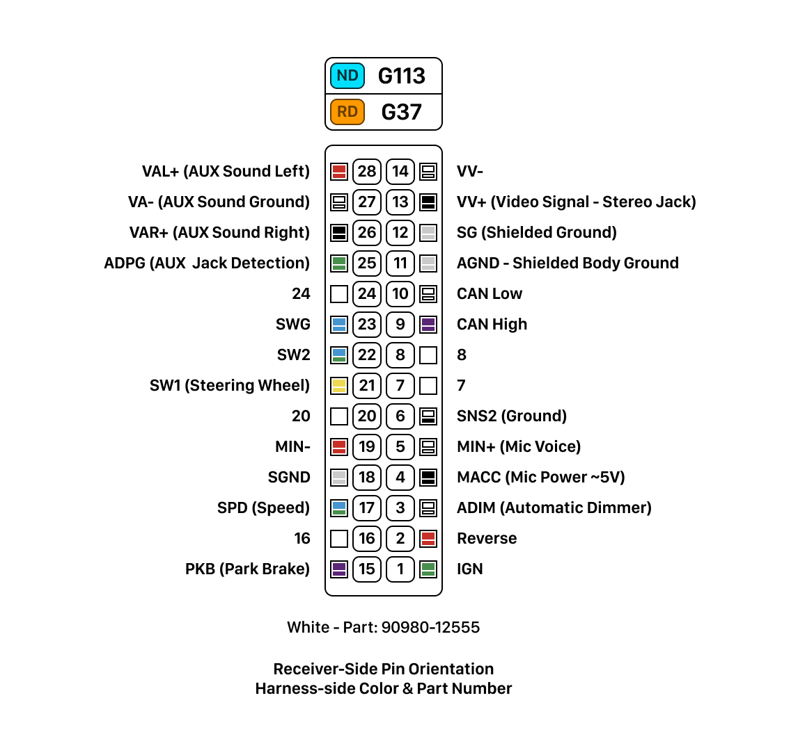
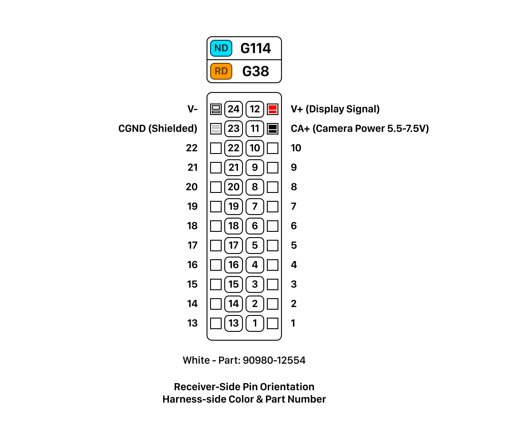
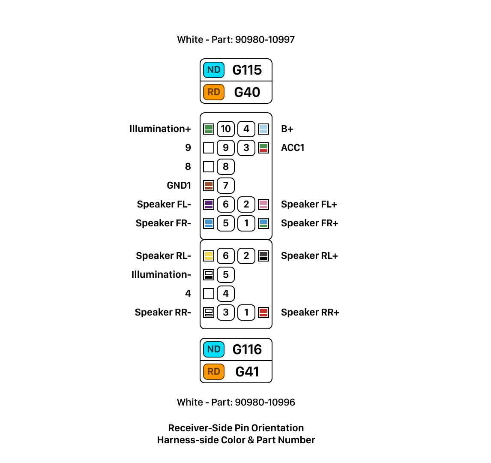

# Navigation Unit Notes

My unit is the SR5 Navigation-spec while the secondhand donor unit I've purchased is from an SR, similar unit without Navigation. Toyota refers to these as **Navigation Display (ND)** and **Radio Receiver Display (RD)** type units.

| Unit | Type | Fascia ID | Model |
|------|------|-----------|-------|
| SR5 | **ND** | 100409 | 86100-OK140 |
| SR | **RD** | 100405 | 86140-OK200 |

## Connectors

The two units have near identical connector layouts, though the Toyota wiring diagram refers to them with different `G Codes`. We need to use four connectors from the harness to power and control the head unit. _The part numbers refer the harness-side male connector_.

    WID: Wiring Diagram Connector Code

| Part No | ND (WID) | RD (WID) | Notes |
|-|-|-|-|
| 90980-12555 | G113 **(K)** | G37 **(A)** | Mic, Steering, Auto Dim |
| 90980-12554 | G114 **(L)** | G38 **(B)** | Television Camera |
| 90980-10997 | G115 **(M)** | G40 **(C)** | Batt, Acc, Front Speakers |
| 90980-10996 | G116 **(N)** | G41 **(D)** | Rear Speakers |

  

## Reverse Camera

Connector `G114` provides access to the television camera assembly, which needs between **5.5V** and **7.5V** so will require a special power supply. (This will be why adapter harnesses have a power brick...)

## Steering Wheel Switches

The Volume, Seek, Mode, Voice and Phone switches present different voltages at `SW1` and `SW2`, though they can just exceed **3V** which may make them unsuitable for straight connection to the rPI. 

## Illumination

The light switch signal when in tail or headlight is `B+` power at `ILL+` with the `ILL-` signal being pulse-width modulated based on dash dim setting. This is not useful when the the light switch is in the **auto** position. Automatic Dimming `ADIM` is `B+` power when in **auto** and the automatic light control sensor is in 'dark/night' state. 

For this project, `ADIM` will be the main switch for the UI night theme to day theme, this is also how the stock headunit switches themes.

## Reverse Signal

This is `B+` voltage so will need voltage conversion to rPI **3V3**.

## Microphone Amplifier

The microphone amplifier power source from the head unit `MACC` is between **4V** to **6V**. **5V** out from main power should be perfect?

## System Power and Accessory Trigger

`B+` is betwen **11V** and **14V** so will need to be converted to **5V** for Display and rPI power. `ACC` will will need to power a relay coil to switch **5V** for display power and **3V3** for rPI wakeup from sleep trigger.

## Display Power

As noted in **System Power** the display needs a dedicated or switched power source using `ACC` as the trigger.