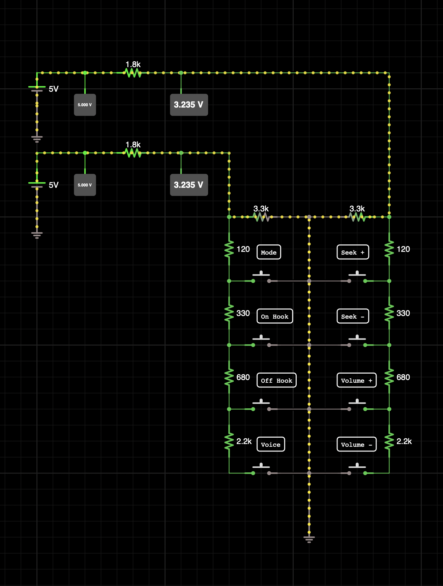
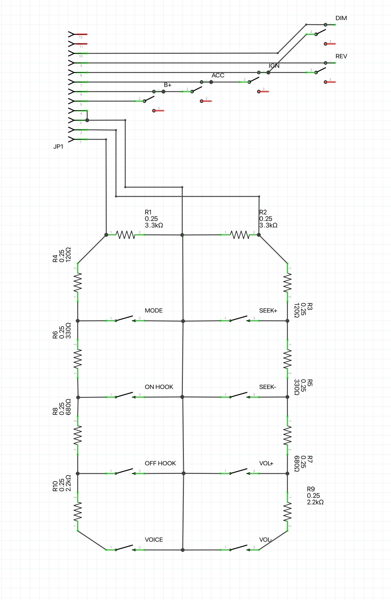
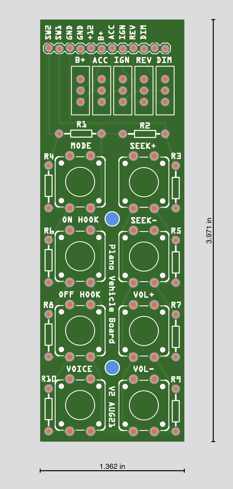

# Vehicle Board

Plano needs a number of hardware inputs and triggers from the vehicle harness. This board is designed to replicate the steering wheel controls, ignition system and automatic light dimming.

    The Fritzing exports are also in the `assets` directory for this board.

## Steering Wheel Controls

Toyota uses a dual 'stepped resisitor' circuit for the audio and phone controls on the steering wheel. With a 5V supply and the diagnostic information from the service manual, we can work out roughly what the resistor values are using iCircuit.

With a basic voltage divider, the voltage can be safely piped into an ADC for reading via I2C into the main controller.

## Board Circuit

With **12V** supplied to this board, the additional switches act as an isolator for the Plano Main Board, providing it with **B+**, **ACC**, and **IGN** for ignition related actions. The **REV** switch is for testing the reverse camera trigger. The **DIM** switch simulates "dark out and automatic lights on" to automatically switch Plano into night mode.

The board as rendered by Aisler, whom are in the process of manufacturing it. It's my first board so fingers crossed it works...

